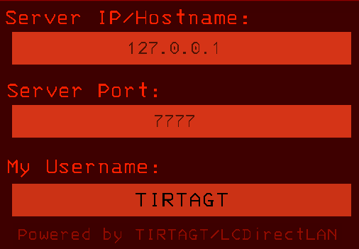

# LCDirectLAN

LCDirectLAN is a mod for Lethal Company that is built around BepInEx to fix and enhances LAN lobbies without interfering with the Steam-networked lobbies.

Lethal Company's LAN mode is not exactly "**LAN** only" mode, but more of a "**Direct Connect** mode", as it allows players to join lobbies directly anywhere it is hosted, including **over the internet**. Unfortunately as far as v49, the game's built-in LAN join didn't seem to work... atleast for my community, this mod aims to fix that and even provide more Quality of Life features for LAN lobbies.

 

This project is open source and are released under the MIT License, for more information, please read the [LICENSE](./LICENSE) file in the project repository.

Checkout the project [Wiki page](../../wiki) for more detailed information such as Installation, Configuration, Compatibility, and more.

 

----

### Features (Fixes and Enhancements to LAN Lobbies)
- Modify Lobby Hosting Port, allowing multiple lobbies to be hosted in the same IP Address.

- Manual IP and Port input for joining lobby.

- Supports automatic join configuration via DNS (SRV, TXT, AAAA, A)

- Custom Username support, not related to the Steam Username.

- In-Game Latency display, (RTT/One-Way Measurement):

- Slow Server Detection

- Modify the game default join connect timeout value to a custom value.

Screenshots, and more detailed information about the features are available on the [Wiki/Features](../../wiki/Features) page.

----

### Contributing

Contributions to LCDirectLAN are welcome, whether it's bug report, interesting feature request, or pull requests.

For guide on contributing source code or directly modifying the project's code, please set up your development environment by following the [Wiki/Contributing](../../wiki/Contributing) page.

----

### Third-Party DLL Dependencies
- [DnsClient](https://www.nuget.org/packages/DnsClient)
- [System.Buffers](https://www.nuget.org/packages/System.Buffers/)